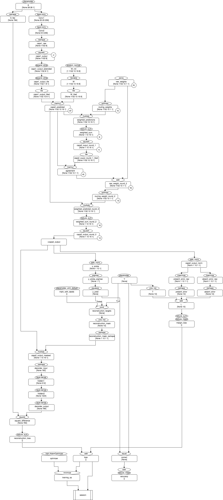
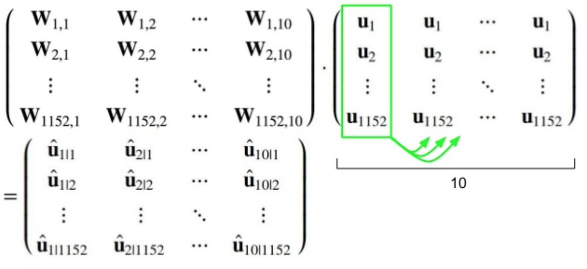
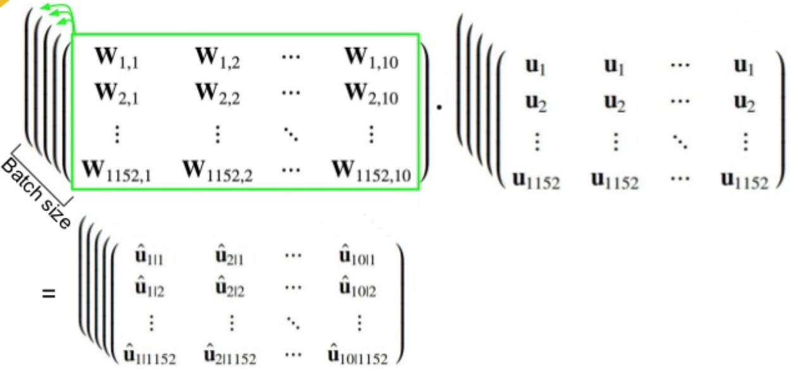
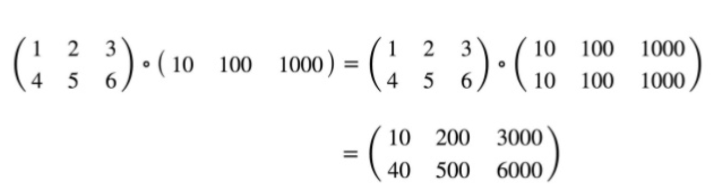
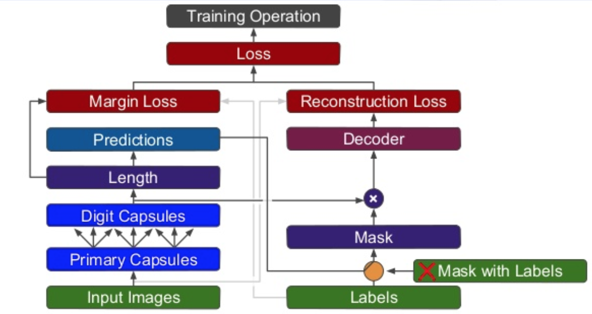

# Capsule Network Implementation
* This is implementation of [[Dynamic Routing Between Capsules]](https://arxiv.org/pdf/1710.09829.pdf)
* Most of code and material are taken from [[ageron/handson-ml]](https://github.com/ageron/handson-ml/blob/master/extra_capsnets.ipynb) repository, so take a look if original data is needed.

* 이 저장소는 CapsuleNets을 구현한 다른 저장소에 대해 공부하고 해석하기 위해 만들어 졌습니다. 
* 대부분의 코드는 [[ageron/handson-ml]](https://github.com/ageron/handson-ml/blob/master/extra_capsnets.ipynb)에 있고, 해석을 위하여 다음 영상을 참조하였습니다. [(유투브)](https://www.youtube.com/watch?v=2Kawrd5szHE)

### 코드 실행순서
코드 실행순서는 다음과 같습니다.
1. hello : 텐서플로우 설치 확인
2. mnist : 가동확인
3. net : 훈련 및 결과 확인


### 전체적인네트워크 구성


## 설명
#### Input
X는 placeholder를 통해 이미지를 받아들입니다. [None 28 28 1]로 생성되어져 있습니다.
이후 (9*9 커널, 256개 필터, 1 stride, relu func 로 구성된) CNN을 통해서 [None 20 20 256]으로 전환됩니다.

```python
X = tf.placeholder(shape=[None, 28, 28, 1], dtype=tf.float32, name='X')

conv1_params = {
    "filters": 256,
    "kernel_size": 9,
    "strides": 1,
    "padding": "valid", # no padding
    "activation": tf.nn.relu,
}
# L1 [None 20 20 256]
conv1 = tf.layers.conv2d(X, name="conv1", **conv1_params)
```

#### Primary Caps
다음은 CapsuleNet을 구성합니다. 전단계의 layer에서 다시 (9*9 커널, 2 stride, relu func으로 구성된) CNN을 이용하여 [None 6 6 256] 으로 형성된 이미지를 생성합니다. 이때, 256은 총 8개씩 32개의 묶음으로 구성될 수 있는데, 이는 8차원 벡터로 이루어진 6*6 영상이 32개이 있다는 것을 말합니다. 이들을 벡터로 묶고자, reshape를 하여 [None, 1152, 8]로 만듭니다.

```python
caps1_n_maps = 32
caps1_n_caps = caps1_n_maps * 6 * 6 # 32 * 36 = 1152 (Total 8D vector number)
caps1_n_dims = 8

conv2_params = {
    "filters": caps1_n_maps * caps1_n_dims, # 32 * 8 = 256 Images
    "kernel_size": 9,
    "strides": 2,
    "padding": "valid",
    "activation": tf.nn.relu
}
# L2 [None 6 6 256]
conv2 = tf.layers.conv2d(conv1, name="conv2", **conv2_params)

caps1_raw = tf.reshape(conv2, [-1, caps1_n_caps, caps1_n_dims], name="caps1_raw")
```

#### Squashing
CapsuleNet의 output으로 취급되는 이 결과는 "squashing"이라는 과정을 거치게 됩니다. 이에 따라서 모든 vector의 크기(길이)는 무한대에 가까울 수록 1이 되고, 0에 가까울 수록 0에 매핍되는 효과를 가집니다. 즉, 모든 벡터가 0에서 1사이로 크기가 조정됩니다.

```python
def squash(s, axis=-1, epsilon=np.finfo(float).eps, name=None):
    with tf.name_scope(name, default_name="squash"):
        squared_norm = tf.reduce_sum(tf.square(s), axis=axis, keep_dims=True)
        safe_norm = tf.sqrt(squared_norm + epsilon)
        squash_factor = squared_norm / (1. + squared_norm)
        unit_vector = s / safe_norm
        return squash_factor * unit_vector

# T2 [None 1152 8]
caps1_output = squash(caps1_raw, name="caps1_output")
```

여기에서 구현된 squash 함수에는 한가지 유의 점이 있습니다. 먼저 tf.square을 이용하여 각자의 원소를 제곱한뒤, reduce_sum을 이용하여 마지막 차원(axis = -1)(8차원)을 합하여 더합니다. 이후 epsilon을 더하여 주는데, 이는 벡터의 크기가 0일 경우, 논문에서 주어진 식(1)이 nan이 될 가능성이 있기 때문입니다.

1152개의 8차원 벡터는, (6 * 6 * 32) 이제 다음 Capsule Network인 DigitCaps로 넘어가게 됩니다. DigitCaps는 10개의 숫자마다 16차원(16D)의 예측 벡터를 가지게 되는데요, 이 벡터의 크기(길이)는 곧 그 숫자의 존재 확률을 의미합니다. 이 를 위해서는 첫번째 캡슐(Pirymary)에서 나온 결과인 8D 벡터를 16D로 치환하는 8*16의 변환 행렬이 필요함을 의미합니다.

즉 8D한개마다 10개의 16D차원으로 변환되는 행렬이 존재해야 합니다. 그리고 이미지 한개마다 1152개의 8D벡터가 존재합니다. 주어진 식이 u1|1 = W11 * u1 이고, u1은 방금 계산된 squashing된 벡터, W11은 변환 행렬이므로, [16 * 1] = [16 * 8] * [8 * 1]입니다. 

#### Efficient way to calculate DigitCaps



이를 TF에서 효율적으로 계산하기 위해서는 위 그림과 같이 1152개를 동시에, 그리고 들어오는 데이터 수많큼 이 일을 반복할 수 있도록 지정하는 일입니다. 그러기 위해서는 u1 을 10개 복사하여, 10개의 u1에 대하여 각 숫자 10개 (16D)에 해당하는 결과 벡터를 계산 하도록 W를 작성합니다.그러므로 W의 shape는 [batch_size, 1152, 10, 16, 8] 가 됩니다. (이미지 하나당 1152개의 u에 대해서 10개의 숫자에 해당하는 8D를 16D로 바꾸는 변환행렬)

변환행렬을 작성하면, W_init을 통해 먼저 (1152, 10, 16, 8)에 해당하는 random 행렬을 만들고, W를 사용하여 이를 변수로 지정한뒤 tile을 이용하여 이미지 한개당 처리할 수 있도록 조정합니다.

```python
init_sigma = 0.01

# V1 [1, 1152, 10, 16, 8]
W_init = tf.random_normal(
    shape=(1, caps1_n_caps, caps2_n_caps, caps2_n_dims, caps1_n_dims),
    stddev=init_sigma,
    dtype=tf.float32,
    name="W_init")
# L3 [1, 1152, 10, 16, 8]
W = tf.Variable(W_init, name="W")

# [BatchSize(None), 1152, 10, 16, 8]
batch_size = tf.shape(X)[0]
W_tiled = tf.tile(
    W,
    [batch_size, 1, 1, 1, 1],
    name="W_tiled")
```

다음은 1차 캡슐에서 결과로 나온 [None, 1152, 8] 행렬을 이 변환행렬에 집어넣을 수 있도록 변환하는 것인데요, 먼저 두번의 차원 증폭을 통해서 [None 1152, 1, 8, 1] 로 작성한뒤 (변환행렬이 4D이므로, 입력값 역시 4D가 되어야 합니다.) 10개의 숫자에 대해 한번에 계산하므로, tile을 이용해 [None 1152, 10, 8, 1] 이 되도록 맞추어 줍니다.

```python
# [None, 1152, 8, 1]
caps1_output_expanded = tf.expand_dims(
    caps1_output,
    -1,
    name="caps1_output_expanded")

# [None, 1152, 1, 8, 1]
caps1_output_tile = tf.expand_dims(
    caps1_output_expanded,
    2,
    name="caps1_output_tile")

# [None, 1152, 10, 8, 1]
caps1_output_tiled = tf.tile(
    caps1_output_tile,
    [1, 1, caps2_n_caps, 1, 1],
    name="caps1_output_tiled")
```

이제 변환행렬 W와 1차 결과 u를 곱하게 되면 예측 결과가 8D차원 1개당 10개의 숫자에 대한 16D로 나오게 되는데, 이 결과는 곧 [None 1152, 10, 16, 1]가 의미하는 바와 같습니다.

```python
# [None, 1152, 10, 16, 1]
caps2_predicted = tf.matmul(
    W_tiled,
    caps1_output_tiled,
    name="caps2_predicted")
```

#### Routing by agreement
이제 다음결과는 sj로 여기에 softmax로 (논문에서 수식 3) 구해진 routing_weight(cij)을 곱한뒤 더하는 가중합과 같은데, 논문에서는 수식 (2)에 해당합니다. uj|i를 전 단계에서 구하였으므로, cij을 구해 더하면 가중합 sj가 나오게 됩니다.

bij는 처음에는 0으로 초기화 되므로, zeros를 이용해 [None 1152 10 1 1] 행렬을 만들고, softmax 과정을 거쳐서 cij 행렬을 만들어 앞서 uj|i가 계산된 행렬과 원소간 곱을 한뒤 더하는 것으로 한꺼번에 효율적으로 같이 계산될 수 있습니다. (j는 1에서 10까지, i는 1에서 1152까지) 이떄 주의할점은, 두번째 캡슐 네트워크의 결과인 uj|i는 분명 [None 1152, 10, 16, 1]인데, 어떻게 해서 원소곱을 할 수 있는지에 대해 생각해야 합니다. 이는 TF에서 제공되는 broadcasting이라는 효과 때문입니다.

```python
# [None, 1152, 10, 1, 1]
raw_weights = tf.zeros(
    [batch_size, caps1_n_caps, caps2_n_caps, 1, 1],
    dtype=np.float32,
    name="raw_weights")

# [None, 1152, 10, 1, 1]
routing_weights = tf.nn.softmax(
    raw_weights,
    dim=2,
    name="routing_weights")

# [None, 1152 10 16 1]
weighted_predictions = tf.multiply(
    routing_weights,
    caps2_predicted,
    name="weighted_predictions")
```



broadcasting은 위 그림과 같이 만약 원소간 곱(행렬 곱과 다릅니다)을 행할 때, 차원이 comparative 하다면, 자동으로 원소를 복제하여 계산되는 약속입니다. 따라서 uj|i와 cij를 곱하는 과정이 비교가능한 차원에서 broadcasting을 이용해 자동으로 계산됩니다.

이제 cij와 uj|i의 곱을 reduce_sum과 squash를 통해 계산하면 vj가 나오게 됩니다. 그리고 라우팅 알고리즘에 의해 vj와 uj|i를 내적(scalar product)하여 agreement aij를 이끌어 낼 수 있는데, 이는 단순히 uji[None 1152 10 16 1]을 Transpose하여 vj와 행렬곱 하면 됩니다. 그러기 위하여 [None 1 10 16 1]로 나온 vj를 tile을 이용해 [None 1152 10 16 1]로 변환하는 과정이 추가됩니다. aij는 따라서 [None 1152 10 1 1]로 나오게 됩니다.

```python
# [None, 1, 10, 16, 1]
weighted_sum = tf.reduce_sum(
    weighted_predictions,
    axis=1,
    keep_dims=True,
    name="weighted_sum")

# [None, 1, 10, 16, 1]
caps2_output_round_1 = squash(
    weighted_sum,
    axis=-2,
    name="caps2_output_round_1")

# [None, 1152, 10, 16, 1]
caps2_output_round_1_tiled = tf.tile(
    caps2_output_round_1,
    [1, caps1_n_caps, 1, 1, 1],
    name="caps2_output_round_1_tiled")

# [None, 1152, 10, 1, 1]
agreement = tf.matmul(
    caps2_predicted,
    caps2_output_round_1_tiled,
    transpose_a=True,
    name="agreement")

```

#### (update routing once)
aij를 이용하여 다시 bij를 업데이트 하는 과정은 bij와 aij를 더한뒤, 새로운 bij를 이용하여 새로운 sj를 구하는 것과 같습니다. 새로운 bij 텐서를 만든뒤에 다시 uj|i와 곱한뒤 위와 같은 일련의 과정을 거치는 것과 같습니다.

```python
# [None 1152, 10, 1, 1]
raw_weights_round_2 = tf.add(
    raw_weights,
    agreement,
    name="raw_weights_round_2")

# [None, 1152, 10, 1, 1]
routing_weights_round_2 = tf.nn.softmax(
    raw_weights_round_2,
    dim=2,
    name="routing_weights_round_2")

# [None, 1152, 10, 16, 1]
weighted_predictions_round_2 = tf.multiply(
    routing_weights_round_2,
    caps2_predicted,
    name="weighted_predictions_round_2")

# [None, 1, 10, 16, 1]
weighted_sum_round_2 = tf.reduce_sum(
    weighted_predictions_round_2,
    axis=1,
    keep_dims=True,
    name="weighted_sum_round_2")

# [None, 1, 10, 16, 1]
caps2_output_round_2 = squash(
    weighted_sum_round_2,
    axis=-2,
    name="caps2_output_round_2")

# [None, 1, 10, 16, 1]
caps2_output = caps2_output_round_2
```
#### Get result
새로운 vj [None 1 10 16 1]를 얻었다면 이제 이것을 각 숫자에 대한 확률로 바꿔 y_pred 값을 얻을 수 있습니다. 이때, 16D에 해당하는 vector length가 0으로 나와 학습이 안 되는 경우를 방지하기 위해서(*?) TF에서 제공하는 norm 함수 대신 epsilon을 더해 norm을 구하는 직접 만든 safe_norm을 사용합니다. 16D 벡터 10개의 norm을 구하면 이제 [None 1 10 1]에 해당하는 각 확률이 나오게 됩니다. 이를 차례대로 argmax와 squeeze를 이용하여 한개의 label로 변환합니다.

```python
def safe_norm(s, axis=-1, epsilon=1e-7, keep_dims=False, name=None):
    with tf.name_scope(name, default_name="safe_norm"):
        squared_norm = tf.reduce_sum(
            tf.square(s),
            axis=axis,
            keep_dims=keep_dims)
        return tf.sqrt(squared_norm + epsilon)

y_proba = safe_norm(caps2_output, axis=-2, name="y_proba")
y_proba_argmax = tf.argmax(y_proba, axis=2, name="y_proba")
y_pred = tf.squeeze(y_proba_argmax, axis=[1,2], name="y_pred")
y = tf.placeholder(shape=[None], dtype=tf.int64, name="y")
```

#### Correct & Accuracy
이제 training 단계에서는 y와 y_pred가 같은지 확인하여, correct를 체크하고, 이를 1과 0으로 cast한뒤 다 더하여 판단하는 accuracy 역시 계산합니다.

```python
correct = tf.equal(y, y_pred, name="correct")
accuracy = tf.reduce_mean(tf.cast(correct, tf.float32), name="accuracy")
```

### Get margin loss
마지막으로 margin_loss와 reconstruction_loss를 더한 최종 loss를 계산하기 위해서 network를 작성하면, margin_loss Lk는 논문에 구현된 수식(4)임을 확인하여, 계산하는데, 이때 10개를 동시에 계산할 수 있도록 작성됩니다. T는 one_hot을 이용하여 들어오는 Y라벨에 대하여 [None 10]을 구성하고, Vk의 norm(크기)는 vj에서 각각 safe_norm을 계산하여 16D 10개의 크기를 [None 10]으로 변환하여 가져옵니다. 이후 max 함수와 square함수를 이용해 준식을 계산하면, Lk [None 10]이 완성됩니다.

```python
caps2_output_norm = safe_norm(
    caps2_output,
    axis=-2,
    keep_dims=True,
    name="caps2_output_norm")

present_error_raw = tf.square(
    tf.maximum(0.,m_plus - caps2_output_norm),
    name="present_error_raw")

present_error = tf.reshape(
    present_error_raw,
    shape=(-1, 10),
    name="present_error")

absent_error_raw = tf.square(
    tf.maximum(0.,caps2_output_norm - m_minus),
    name="absent_error_raw")

absent_error = tf.reshape(
    absent_error_raw,
    shape=(-1, 10),
    name="absent_error")

T = tf.one_hot(y, depth=caps2_n_caps, name="T")

m_plus = 0.9
m_minus = 0.1
lambda_ = 0.5

L = tf.add(T * present_error,
           lambda_ * (1.0 - T) * absent_error,
           name="L")
```

margin_loss는 Lk를 모두 더한 값이므로, 다 더하게 되면 margin_loss가 나오게 됩니다.

```python
margin_loss = tf.reduce_mean(
    tf.reduce_sum(L, axis=1),
    name="margin_loss")
```

#### Get reconstruction loss
reconstruction loss를 계산하기 위해서는 논문의 figure2에 해당하는 구조가 필요합니다. training 중에는 y 라벨이 제공되기 때문에 y에게 one_hot을 사용한뒤 mask를 해서 구하면 되지만, test중에는 y라벨이 제공되지 않으므로 y_pred를 이용하도록 TF함수를 이용하여 mark_with_label이 True일 때는 y를, False일때는 y_pred를 사용할 수 있게 설정합니다. 사용하도록 정해진 대상은 reconstruction_target에 저장됩니다.



```python
mask_with_labels = tf.placeholder_with_default(
    False,
    shape=(),
    name="mask_with_labels")

reconstruction_targets = tf.cond(
    mask_with_labels, # condition
    lambda: y,        # if True
    lambda: y_pred,   # if False
    name="reconstruction_targets")
```

이 정보를 이용하여, one_hot을 통해 mask를 생성하고, mask [None 10]와 vj를 [None 1 10 16 1] 곱할 수 있도록 mask를 reshape [None 1 10 1 1]하고, broadcasting을 이용한 내적을 수행합니다.

```python
reconstruction_mask = tf.one_hot(
    reconstruction_targets,
    depth=caps2_n_caps,
    name="reconstruction_mask")

reconstruction_mask_reshaped = tf.reshape(
    reconstruction_mask,
    [-1, 1, caps2_n_caps, 1, 1],
    name="reconstruction_mask_reshaped")

caps2_output_masked = tf.multiply(
    caps2_output,
    reconstruction_mask_reshaped,
    name="caps2_output_masked")
```

결과적으로 [None 1 10 16 1]과 같은 10개의 16D에 1개의 숫자만 one_hot으로 두고 내적곱한 결과가 나오게 되면, 이를 reshape하여 160개의 flat한 행렬로 변환합니다. 이것을 다시 512개, 1024개, 784 (28 * 28)의 fully-connected net으로 연결하여, 최종적으로 28 * 28의 flat한 행렬로 변환합니다.

```python
decoder_input = tf.reshape(
    caps2_output_masked,
    [-1, caps2_n_caps * caps2_n_dims],
    name="decoder_input")

n_hidden1 = 512
n_hidden2 = 1024
n_output = 28 * 28

with tf.name_scope("decoder"):
    hidden1 = tf.layers.dense(
        decoder_input,
        n_hidden1,
        activation=tf.nn.relu,
        name="hidden1")

    hidden2 = tf.layers.dense(
        hidden1,
        n_hidden2,
        activation=tf.nn.relu,
        name="hidden2")

    decoder_output = tf.layers.dense(
        hidden2,
        n_output,
        activation=tf.nn.sigmoid,
        name="decoder_output")

```

이제 이 결과와 x_flat이라는 입력 영상을 784개의 flat한 행렬로 변환한 것과 차이값을 제곱하여 더하면, reconstruction_loss를 구할 수 있습니다.

```python
X_flat = tf.reshape(
    X,
    [-1, n_output],
    name="X_flat")

squared_difference = tf.square(
    X_flat - decoder_output,
    name="squared_difference")

reconstruction_loss = tf.reduce_sum(
    squared_difference,
    name="reconstruction_loss")
```

#### Get loss
마지막으로 loss는 두개의 loss를 더하는데, 이 때 margin_loss를 주로 반영하는 형태로 생각하고 더하게 됩니다.

```python
alpha = 0.0005

loss = tf.add(margin_loss, alpha * reconstruction_loss, name="loss")
```

#### Optimizer
마지막으로 loss를 줄이기 위하여 optimizer를 논문에서 사용한 AdamOptimizer을 사용하여 loss를 minimize 하도록 작성합니다.

```python
optimizer = tf.train.AdamOptimizer()
training_op = optimizer.minimize(loss, name="training_op")
```

#### Init & Savor
이후 tf.variable로 작성된 텐서들을 초기화 하고, save_point를 만들 savor을 설정한뒤에, 학습을 진행합니다.

```python
init = tf.global_variables_initializer()
saver = tf.train.Saver()
```

#### Train
학습과정은 train operator를 진행하는 동시에 진행중에 loss가 계산되도록 하기 위해서 두가지 op를 넣고 session을 진행합니다. (자동으로 트리의 의존성을 계산하여 root부터 계산하여 내려옵니다.) 그리고 epoch의 끝마다, 정확도를 계산합니다.

```python
n_epochs = 10
batch_size = 50
restore_checkpoint = True

n_iterations_per_epoch = mnist.train.num_examples // batch_size
n_iterations_validation = mnist.validation.num_examples // batch_size
best_loss_val = np.infty
checkpoint_path = "./my_capsule_network"

with tf.Session() as sess:
    if restore_checkpoint and tf.train.checkpoint_exists(checkpoint_path):
        saver.restore(sess, checkpoint_path)
    else:
        init.run()

    for epoch in range(n_epochs):
        for iteration in range(1, n_iterations_per_epoch + 1):
            X_batch, y_batch = mnist.train.next_batch(batch_size)
            # Run the training operation and measure the loss:
            _, loss_train = sess.run(
                [training_op, loss],
                feed_dict={X: X_batch.reshape([-1, 28, 28, 1]),
                           y: y_batch,
                           mask_with_labels: True})
            print("\rIteration: {}/{} ({:.1f}%)  Loss: {:.5f}".format(
                      iteration, n_iterations_per_epoch,
                      iteration * 100 / n_iterations_per_epoch,
                      loss_train),
                  end="")

        # At the end of each epoch,
        # measure the validation loss and accuracy:
        loss_vals = []
        acc_vals = []
        for iteration in range(1, n_iterations_validation + 1):
            X_batch, y_batch = mnist.validation.next_batch(batch_size)
            loss_val, acc_val = sess.run(
                    [loss, accuracy],
                    feed_dict={X: X_batch.reshape([-1, 28, 28, 1]),
                               y: y_batch})
            loss_vals.append(loss_val)
            acc_vals.append(acc_val)
            print("\rEvaluating the model: {}/{} ({:.1f}%)".format(
                      iteration, n_iterations_validation,
                      iteration * 100 / n_iterations_validation),
                  end=" " * 10)
        loss_val = np.mean(loss_vals)
        acc_val = np.mean(acc_vals)
        print("\rEpoch: {}  Val accuracy: {:.4f}%  Loss: {:.6f}{}".format(
            epoch + 1, acc_val * 100, loss_val,
            " (improved)" if loss_val < best_loss_val else ""))

        # And save the model if it improved:
        if loss_val < best_loss_val:
            save_path = saver.save(sess, checkpoint_path)
            best_loss_val = loss_val
```

#### Test
test과정은 마찬가지로 accuracy와 loss를 이용하여 test data set을 이용하여 계산합니다.

```python
n_iterations_test = mnist.test.num_examples // batch_size

with tf.Session() as sess:
    saver.restore(sess, checkpoint_path)

    loss_tests = []
    acc_tests = []
    for iteration in range(1, n_iterations_test + 1):
        X_batch, y_batch = mnist.test.next_batch(batch_size)
        loss_test, acc_test = sess.run(
                [loss, accuracy],
                feed_dict={X: X_batch.reshape([-1, 28, 28, 1]),
                           y: y_batch})
        loss_tests.append(loss_test)
        acc_tests.append(acc_test)
        print("\rEvaluating the model: {}/{} ({:.1f}%)".format(
                  iteration, n_iterations_test,
                  iteration * 100 / n_iterations_test),
              end=" " * 10)
    loss_test = np.mean(loss_tests)
    acc_test = np.mean(acc_tests)
    print("\rFinal test accuracy: {:.4f}%  Loss: {:.6f}".format(
        acc_test * 100, loss_test))
```

#### Predict
실제 학습된 모델을 이용해 예측은 저장된 행렬을 불러온뒤 session에 각각 caps2_output과 (10 * 16) decorder_output(reconsturction_result), y_pred(라벨값)을 요청하고, feed_dict에는 해당하는 이미지를 넣습니다.

```python
n_samples = 5

sample_images = mnist.test.images[:n_samples].reshape([-1, 28, 28, 1])

with tf.Session() as sess:
    saver.restore(sess, checkpoint_path)
    caps2_output_value, decoder_output_value, y_pred_value = sess.run(
            [caps2_output, decoder_output, y_pred],
            feed_dict={X: sample_images,
                       y: np.array([], dtype=np.int64)})

sample_images = sample_images.reshape(-1, 28, 28)
reconstructions = decoder_output_value.reshape([-1, 28, 28])

plt.figure(figsize=(n_samples * 2, 3))
for index in range(n_samples):
    plt.subplot(1, n_samples, index + 1)
    plt.imshow(sample_images[index], cmap="binary")
    plt.title("Label:" + str(mnist.test.labels[index]))
    plt.axis("off")

plt.show()

plt.figure(figsize=(n_samples * 2, 3))
for index in range(n_samples):
    plt.subplot(1, n_samples, index + 1)
    plt.title("Predicted:" + str(y_pred_value[index]))
    plt.imshow(reconstructions[index], cmap="binary")
    plt.axis("off")

plt.show()
```
